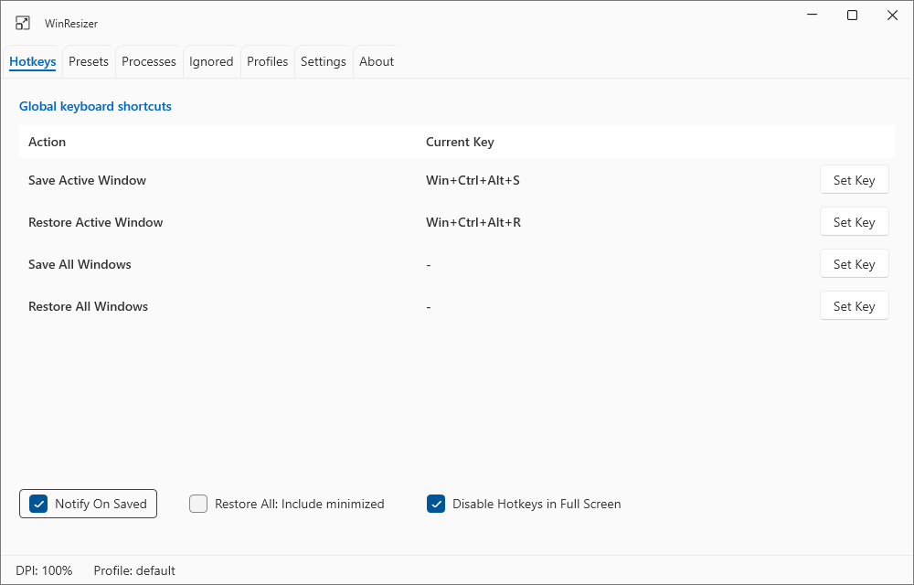
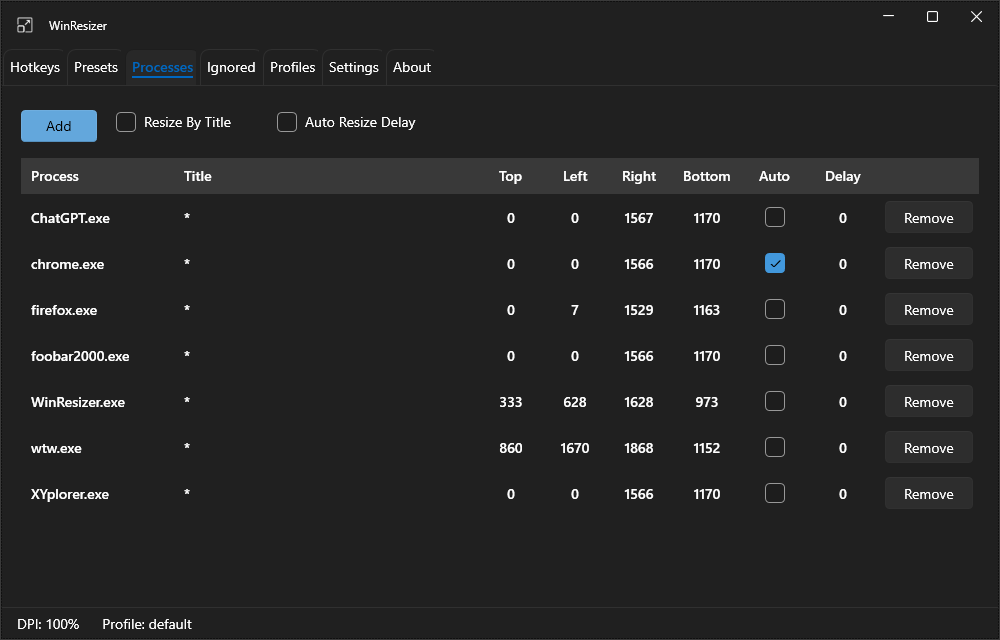
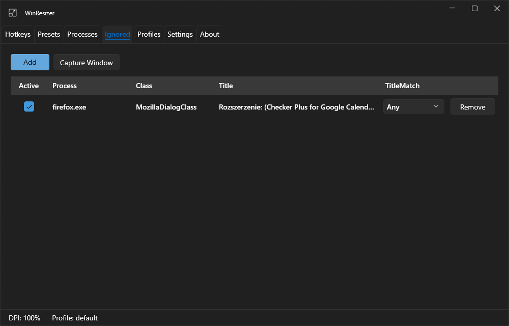

# WinResizer

WinResizer is a lightweight, portable Windows 10/11 x64 utility built with WPF and .NET Framework 4.8 for saving, restoring, and automatically managing window positions and sizes.

It supports multi-monitor setups with different DPI scaling levels, reusable presets, profiles, global hotkeys, automatic window resizing, process and window-title matching, and ignored-window rules for excluding dialogs, popups, or other windows that should not be resized.

## Features

- Save and restore window position and size
- Automatic resizing of matching windows
- Multi-monitor and mixed-DPI support
- Reusable window presets
- Multiple configuration profiles
- Global hotkeys
- Matching by process and window title
- Ignored-window rules for dialogs, popups, and other exceptions
- Portable configuration stored next to the application
- Designed for Windows 10/11 x64
- No installation required







## Usage

1. Run `WinResizer.exe`.
2. Open the **Processes** tab and configure the window or process you want to manage.
3. Set the desired window position and size, then save the entry.
4. Enable **Auto Resize** to automatically restore the saved position and size when the matching window appears.
5. Assign a global hotkey if you want to apply the saved position and size manually.
6. Use the **Ignored** tab to exclude specific windows from automatic resizing, for example application dialogs or popup windows.

### Window matching

WinResizer can match windows by process name or by process name and window title. Title matching is useful when only selected windows of the same application should be resized.

## Portable configuration

On first run, WinResizer creates its configuration file beside the executable:

```text
WinResizer.config.json
```

The portable release ZIP intentionally does not contain this file. Extracting a newer release over an existing directory therefore leaves the user's configuration untouched.

## Build

Requirements:

- Windows x64
- .NET Framework 4.8 developer tools
- Visual Studio 2022 or compatible MSBuild

Production WPF build:

```powershell
dotnet build .\src\WinResizer\WinResizer.csproj -c Release -f net48 -p:Platform=x64 -p:PlatformTarget=x64
```

Expected executable:

```text
src\WinResizer\bin\x64\Release\net48\WinResizer.exe
```

Solution:

```text
WinResizer.sln
```

## CLI

The repository also contains the `WinResizer.CLI` source project. The CLI is not included in the standard portable WinResizer release.

```powershell
WinResizer.CLI.exe resize --help
```

## Upstream and license

WinResizer is derived from the original [WindowResizer](https://github.com/caoyue/WindowResizer) project by caoyue.

WinResizer is distributed under the MIT License. See `LICENSE` and `NOTICE.txt` for license and attribution information.
